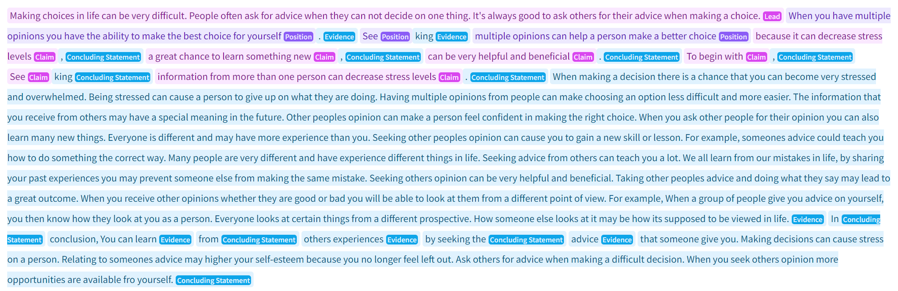

# Discourse Classification


### Description
Discourse_classification is a Longformer model designed to identify different discourse elements in a student's writing. The model is fine-tuned for NER Token Classification and uses the [PERSUADE](https://www.kaggle.com/c/feedback-prize-2021/data) dataset for training.

### Paper - [Identifying discourse elements in writing by fine-tuning BERT, LongFormer, and GPT-2 models for NER Token Classification](https://github.com/Brad1141/Discourse_Classification/blob/master/Brad_LaMontagne%20(2).pdf)

#### All Discourse Elements (NER Token Classifiers)
First, the model divides the corpus into distinct discourse elements and then the elements are classified as one of the following...
- Lead: an introduction that begins with a statistic, a quotation, a description, or some other device to grab the reader’s attention and point toward the thesis
- Position: an opinion or conclusion on the main question
- Claim: a claim that supports the position
- CounterClaim: a claim that refutes another claim or gives an opposing reason to the position
- Rebuttal: a claim that refutes a counterclaim
- Evidence: ideas or examples that support claims, counterclaims, or rebuttals
- Concluding Statment: a concluding statement that restates the claims

### Example


### Run in browser
1. Go to website https://huggingface.co/brad1141/Longformer_v5
2. Under **Hosted inference API**, paste the corpus that you wish to evaluate 

### Run on computer
*following code also available in the **runModel.ipynb** file*
```python
from transformers import pipeline

model_checkpoint = "brad1141/Longformer_v5"
token_classifier = pipeline(
    "token-classification", model=model_checkpoint, aggregation_strategy="simple"
)

# code for evaluating a single text
predicts = token_classifier("YOUR TEXT HERE")
for p in predicts:
    print(p)

```
### Kaggle Submission
To evaluate your texts and create a csv file in Kaggle [Submission file format](https://www.kaggle.com/c/feedback-prize-2021/overview/evaluation), run the file **kaggleRun.ipynb** with your own text folder
